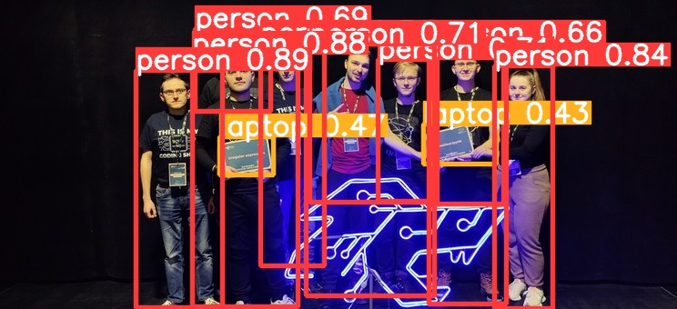

[](https://github.com/knmlprz/poradniki/blob/main/resources/Notebooks.png)
[](https://github.com/knmlprz/) [](https://discord.com/invite/ZYJdXXgE6H) [](https://t.me/s/knmlprz)

---

## Zawartość kursu

W tym kursie nauczycie się:

1. Co potrafi model YOLOv8 i jak przygotować swoje środowisko do pracy z nim.
2. Jak pracuje się z CLI YOLOv8.
3. Jak przygotowuje się własny zbiór danych dla modelu przy pomocy platformy Roboflow.
4. Wytrenujecie podczas zajęć własny model, wykrywający wybrany przez was obiekt. Trenowanie przeprowadzimy na GPU koła naukowego.

---

## Przygotowanie do kursu

Aby w pełni uczestniczyć w kursie potrzebne będą następujące programy/konta na platformach/datasety/sprzęt:

1. Konto Google (potrzebne do Google Colab)
2. Konto na platformie [Roboflow](https://roboflow.com/). Wystarczy darmowe konto.
3. (opcjonalne) Własny dataset i myszka (dużo łatwiej się na niej anotuje obrazki) , przynajmniej z ~200 obrazków z obiektami. Pozostałe osoby wytrenują model na przygotowanym już wcześniej zbiorze danych.
4. (opcjonalne) Dostęp po SSH do maszyny koła naukowego z zainstalowanym Pythonem i Condą. Pozostali uczestnicy będą mogli zobaczyć jak takie trenowanie wygląda na wcześniej przygotowanym zbiorze danych. Lub pokażę wam jak wytrenować model na waszym zbiorze z podpunktu (3).

---

## Co potrafi model YOLO i jak przygotować środowisko do pracy


Pokażę wam jak przygotować sobie środowisko na platformie google colab. Ale analogicznie przygotowuje się z terminala na serwerze. Link do notebooka macie tutaj: [](https://colab.research.google.com/github/knmlprz/poradniki/blob/main/Python/YOLOv8/YOLOv8_%C5%9Aledzenie_i_zliczanie_obiekt%C3%B3w.ipynb)

## Praca z YOLO CLI

1. Zacznijmy od przygotowania czystego środowiska pod model YOLO.

```sh
conda create -n kurs-yolo python=3.9
conda activate kurs-yolo
```

Sprawdzimy czy mamy dostępne jakieś GPU:

```sh
nvidia-smi
```

Zainstalujmy model YOLOv8:

```sh
pip install --timeout=1000 ultralytics==8.0.57
```

> To polecenie może się "zawiesić". Jeżeli nie widzisz postępu w pobieraniu wciśnij `Crtl + C` i uruchom je jeszcze raz.

Wpisz polecenie, aby sprawdzić czy wszystko zostało zainstalowane poprawnie:

```sh
yolo help
```

Pobierzmy przykładowe zdjęcie i uruchommy na nim predykcję:

```sh
wget https://wmifs.prz.edu.pl/thumb/laWWUHKjYDHVM1WiZnVVwPXghOSxpwV1BeV31CVhsd,7/pl/news/7/381/1/gABoNM1MNe09mBEQ,img_20230115_170135.jpg -O photo.jpg
```

Uruchomienie predykcji:

```sh
yolo predict model=yolov8m.pt source=photo.jpg save=true
```

![[photo 1.jpg]]
Wynik zapisany będzie tu:

```
cd runs/detect/predict
```

(opcjonalne: pobranie na swój komputer)
Skopiuj ścieżkę do pliku:

```
realpath photo.jpg
rsync -azvP knml:/home/pkrawiec/runs/detect/predict/photo.jpg .
```

Przykładowe wejście-wyjście:



## Trenowanie YOLO na własnym zbiorze danych

Do wytrenowania YOLO będziecie potrzebowali zbioru danych. Jeden z nich przygotowałem dla was. Możecie go pobrać pod tym linkiem: [dataset](https://drive.google.com/file/d/1RqOFLIfGBRNCl6ztPlB2gS87f5f_XuIp/view?usp=sharing) Pobierzcie go i wejdźcie na stronę roboflow i utwórzcie nowy projekt.

Project type: bounding box
What are you detecting? people / to co chcecie
Project name: whatever

Teraz przeciągnijcie pobrany zbiór danych do okienka Upload. Wybierzcie ile obrazków ma zostać wyciągniętych z filmu.

Jak skończycie anotować obrazki, pokażę wam jeszcze, jak dodać do swojego datasetu obrazy z innego zbioru także udostępnionego na roboflow. Wejdźcie na mój projekt: [Counting people](https://universe.roboflow.com/rzeszow-university-of-technology/counting-people-in-rzeszow) -> Images -> Select All -> Clone Images to project. I tak oto dostaniecie za darmo obrazki do waszego projektu.


Trenowanie YOLO na własnym datasecie jest bardzo proste. Po wrzuceniu zbioru danych i zaznaczeniu na obrazkach obiektów, wygenerować musimy zbiór testowy i treningowy. Ponieważ anotacja obrazków jest uciążliwa, a będziemy ich potrzebować naprawdę dużo, to posłużymy sie techniką modyfikacji danych. Będziemy generować nowe obrazki ze zbioru pierwotnego poprzez np. rotację, wyszarzanie, odbicie lustrzane itp.

Wejdźcie w zakładkę `Generate` i wygenerujcie nowy zbiór. Użyjcie takich modyfikatorów jakie mają sens w waszym przypadku (ludzie nie chodzą do góry nogami xDD).

Następnie whodzicie w `Versions -> Get Snippet` i wybieracie format: YOLOv8 i download zip to computer. Tak pobierzecie swój zbiór danych.

Rozpakujcie go w swoim folderze.

Wpisując

```sh
yolo help
```

dostaniecie przykładowe polecenie trenujące model.
